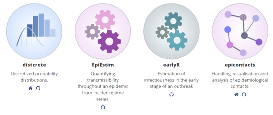
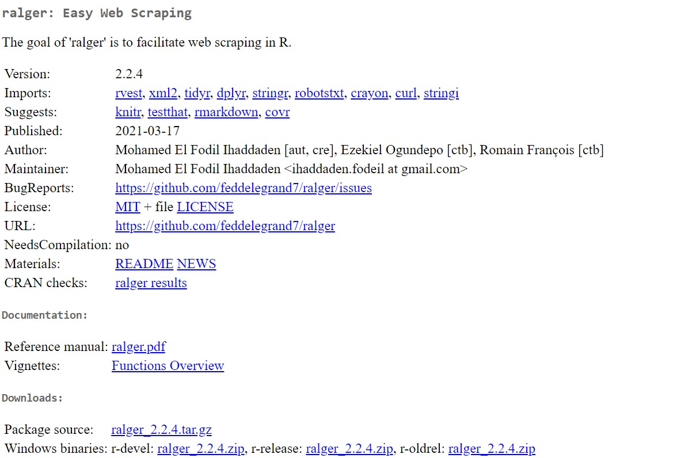

---
output:
  xaringan::moon_reader:
    yolo: false
    lib_dir: libs
    css: xaringan-themer.css
    seal: false
    nature:
      #autoplay: 30000
      #countdown: 60000
      highlightStyle: github
      highlightLines: true
      highlightSpans: true
      countIncrementalSlides: false
      #ratio: 16:9
      slideNumberFormat: "%current%"
editor_options: 
  chunk_output_type: console
---

```{r setup, include=FALSE}
options(htmltools.dir.version = FALSE)

knitr::opts_chunk$set(echo = TRUE, 
                      tidy = 'styler', 
                      comment = NA,
                      message = FALSE,
                      warning = FALSE)
```


```{r xaringan-themer, include=FALSE, warning=FALSE}
library(xaringanthemer)
style_duo_accent(
  primary_color = "#1381B0",
  secondary_color = "#FF961C",
  inverse_header_color = "#FFFFFF"
)

# Loaded packages

install.load::install_load(c("knitr", "xaringanExtra", "xaringan", "tidyverse", "kableExtra", "countdown", "janitor"))

xaringanExtra::use_xaringan_extra(include = c("tile_view", "editable", "share_again", "broadcast", "animate_css", "panelset", "tachyons", "fit_screen", "clipboard", "search", "scribble", "freezeframe"))

use_webcam(width = 150, height = 150)

use_extra_styles()

```

background-image: url(images/logo.png), url(images/R_logo.png)
background-position: 0% 100%, 100% 0%
background-size: 20%, 10%

class: title-page, center, middle

## Easy webscraping with ralger package

```{r, echo=FALSE}
use_logo(
  image_url = "images/",
  link_url = "https://bit.ly/gbganalyst",
  position = xaringanExtra::css_position(top = "1em", right = "1em"),
  exclude_class = c("title-page", "inverse", "hide_logo")
)
```

---
class: about-me-slide, inverse, middle, center

## About Me


### Ezekiel Adebayo Ogundepo

#### Data Specialist

.fade[54gene<br>Lagos, Nigeria]


[`r icons::fontawesome("link")` https://bit.ly/gbganalyst](https://bit.ly/gbganalyst)
[`r icons::fontawesome("twitter")` @gbganalyst](https://twitter.com/gbganalyst)
[`r icons::icon_style(icons::fontawesome("github"), scale = 1)` @gbganalyst](https://github.com/gbganalyst)

---
class: middle

.w-100.lh-copy[

Goal:

> The goal of ralger package is to make abundant of data on the web available to the researchers in real time.
]

---
class: inverse, middle
name: toc

# Major functions in ralger package

.w-100.lh-copy[

- [`scrap()`](#stp1)

- [`table_scrap()`](#stp2)

- [`tidy_scrap()`](#stp3)

- [`weblink_scrap()`](#stp4)
]


---
class: middle
name: stp1

## Released projects and packages

<https://www.repidemicsconsortium.org/projects>

```{r, echo=FALSE, out.height= "30%", out.width="82%"}
  
```


---

# `scap()`

```{r}
library(ralger)

link <- "https://www.repidemicsconsortium.org/projects/"

node <- ".item-name"

pkg_name <- scrap(link = link, node = node)

head(pkg_name)

length(pkg_name)
```

---
name:stp2

## `table_scrap()`

This function is used to scrape an html table from a website.


.panelset[

.panel[.panel-name[COVID-19 Gambia]

```{r}

link <- "https://tradingeconomics.com/gambia/coronavirus-deaths"


data <- table_scrap(link = link)

data
```

]


.panel[.panel-name[COVID-19 Nigeria]

```{r, eval=FALSE}

link <- "https://covid19.ncdc.gov.ng/"

data <- table_scrap(link = link, choose = 1)

data
```

```{r, echo=FALSE}
link <- "https://covid19.ncdc.gov.ng/"

data <- table_scrap(link = link, choose = 1)

names(data) = c("States",  "Lab Confirmed",	"No. of Cases (on admission)", "No. Discharged", "No. of Deaths")

data %>% clean_names()# %>% kable(format = "html")
```


]
]


---
name:stp3

## `tidy_scrap()`

What of if the table is not an HTML table? `tidy_scrap()` is used to do just that.

<https://www.repidemicsconsortium.org/projects>

```{r, eval=FALSE}

link <- "https://www.repidemicsconsortium.org/projects/"

node <- c(".item-name", ".item-desc")

pkg_details <- tidy_scrap(link = link, nodes = node, colnames = c("Packages", "Description"))

pkg_details
```
```{r, echo=FALSE}

link <- "https://www.repidemicsconsortium.org/projects/"

node <- c(".item-name", ".item-desc")

pkg_details <- tidy_scrap(link = link, nodes = node, colnames = c("Packages", "Description")) 

pkg_details %>% mutate(Description = str_wrap(Description))
```

---
name:stp4

## `weblink_scrap()`

This function is used to scrape web links from a website.

<https://www.repidemicsconsortium.org/projects>

```{r, eval=FALSE}

link <- "https://www.repidemicsconsortium.org/projects/"

weblink_scrap(link =link, contain = "github.com")

```

```{r, echo=FALSE}

link <- "https://www.repidemicsconsortium.org/projects/"

weblink_scrap(link =link, contain = "github.com") %>% unique()
```

---
name:stp5

## `paragraphs_scrap()`

This function is used to scrape text paragraphs from a website.


<https://data.org/people/adam-kucharski>

```{r, eval=FALSE}

paragraphs_scrap("https://data.org/people/adam-kucharski", collapse = T)

```

```{r, echo=FALSE}
dd <- paragraphs_scrap("https://data.org/people/adam-kucharski/")[1:2] %>% str_c(collapse = "") %>% str_wrap() 

cat(dd)
```


---
class: middle

## Other functions in ralger

- `titles_scrap()`

- `images_scrap()`

- `attribute_scrap()`

and many more.

---
class: middle

# ralger CRAN Page


```{r, echo=FALSE, out.height= "30%", out.width="82%"}
  

```

---
class: center, middle, inverse

# The end

--

**Thank you**